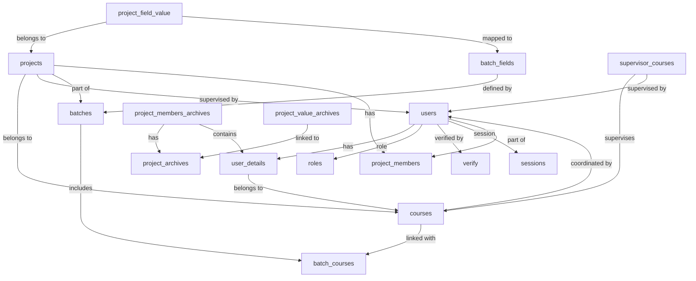

# Creative Innovation Final Project Exhibition and Competition (CIFPEC)

## Overview
CIFPEC is a platform designed to facilitate project management, registration, and data tracking for ADTEC Melaka students. It streamlines competition processes and ensures efficient handling of student projects.

## Objectives
- Provide an intuitive interface for managing project submissions and requirements.
- Ensure role-based access for Admins, Coordinators, Supervisors, and Students.
- Archive finalized projects to optimize system performance and minimize active query loads.
- Implement dynamic batch management for defining project requirements.

## Features
1. **User Roles:**
   - **Admin:** Full access to manage users, projects, batches, and system settings.
   - **Coordinator:** Oversight of projects within a specific course.
   - **Supervisor:** Management of assigned student projects.
   - **Student:** Submission of project details and participation in competitions.

2. **Dynamic Batch Management:**
   - Admins can define custom project requirements for each batch.
   - Requirements include fields such as project name, slide uploads, poster uploads, etc.

3. **Archiving System:**
   - Finalized projects are moved to archives to:
     - Improve system performance.
     - Ensure historical data integrity.
     - Prevent edits to finalized data.

4. **Course and Batch Relationships:**
   - Dynamic mapping between courses and batches for flexible requirement assignment.

5. **Customizable Project Fields:**
   - Admins can add or update project fields for each batch.

## Database Relationships

## API Endpoints
### Authentication
- **POST** `/api/v1/auth/login` - User login
- **POST** `/api/v1/auth/register` - User registration
- **DELETE** `/api/v1/auth/logout` - Logout

### Reset Password
- **POST** `/api/v1/auth/password/reset/request` - Request password reset code
- **POST** `/api/v1/auth/password/reset/verify` - Verify reset code
- **PATCH** `/api/v1/auth/password/reset` - Reset password

### Email Verification
- **POST** `/api/v1/auth/email/verify/request` - Request email verification code
- **POST** `/api/v1/auth/email/verify` - Verify email with code

### User Management
- **GET** `/api/v1/users?page=1&limit=10` - List all users
- **GET** `/api/v1/user/profile` - Get current user profile
- **PATCH** `/api/v1/user/profile` - Update current user profile
- **PATCH** `/api/v1/user/profile/password` - Update user password
- **GET** `/api/v1/users/lecturers?page=1&limit=10` - Get all users with role supervisor
- **PATCH** `/api/v1/users/{userId}/lecturer` - Update user with role supervisor
- **GET** `/api/v1/users/students` - Students with `is_final=false`
- **GET** `/api/v1/batches/{batch_id}/courses/{course_id}/students` - Get students in specific course and batch

### Site Maintenance
- **PATCH** `/api/v1/site/settings` - Update site settings

### Batch Management
- **GET** `/api/v1/batches?page=1&limit=10` - List batches
- **GET** `/api/v1/batches/{id}` - Get batch details
- **POST** `/api/v1/batches` - Create batch
- **PATCH** `/api/v1/batches/{id}` - Update batch

### Project Management
- **POST** `/api/v1/projects` - Create new project
- **GET** `/api/v1/user/projects?page=1&limit=10` - List user projects
- **PATCH** `/api/v1/user/projects/{id}` - Update project

### Final Projects
- **GET** `/api/v1/projects/active?course=course_id&page=1&limit=10` - Get active projects (`is_final=false`)
- **GET** `/api/v1/batches/{batch_id}/projects?page=1&limit=10` - Get projects by batch
- **GET** `/api/v1/batches/{batch_id}/projects/{id}` - Get project details in batch

### Archived Projects
- **GET** `/api/v1/projects?page=1&limit=10` - List all projects (`is_final=true`)
- **GET** `/api/v1/projects/{id}` - Get project details (`is_final=true`)
- **GET** `/api/v1/projects?name=project_name&batch=all&field=all` - Search archived projects by name, batch, or field

### Course Management
- **GET** `/api/v1/courses?page=1&limit=10` - List courses
- **GET** `/api/v1/courses/{id}` - Get course details
- **POST** `/api/v1/courses` - Create course
- **PATCH** `/api/v1/courses/{id}` - Update course

## Notes
- **Archiving:** Finalized projects (`is_final=true`) are moved to `project_archives`.
  - Archived data includes:
    - Project details
    - Project members
    - Custom field values
  - Data in archives cannot be edited.

- **Dynamic Batches:** Batches allow for customizable project requirements. These fields are linked through `batch_fields` and `project_field_value` tables.

## Contributing
1. Fork this repository.
2. Create a new branch for your feature or bug fix.
3. Submit a pull request detailing the changes.

## License
This project is licensed under the MIT License. See the [LICENSE](LICENSE) file for details.
